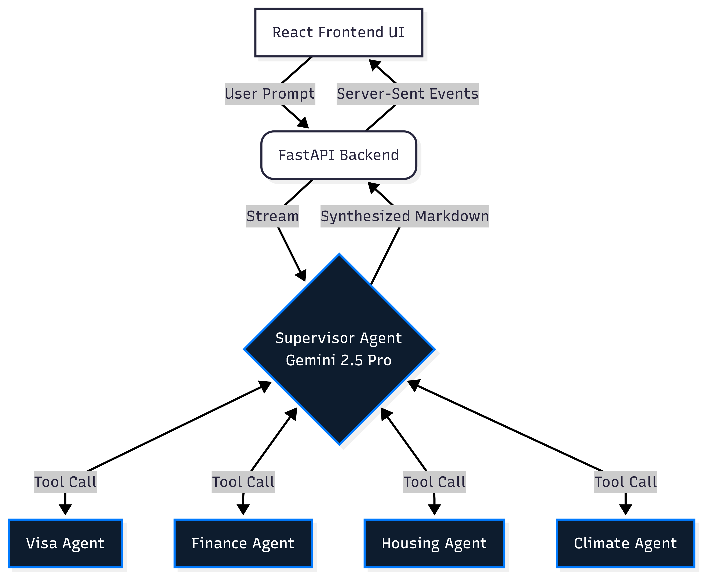
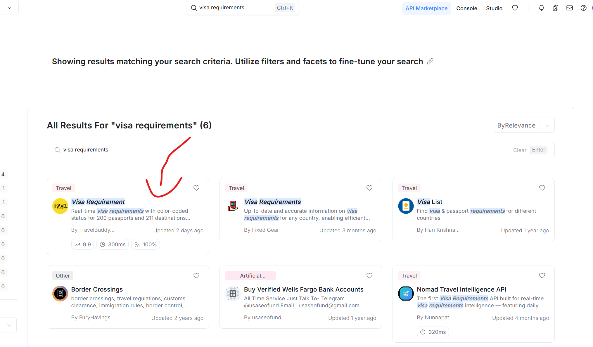

# NexusMigrate: Multi-Agent Relocation Swarm

NexusMigrate is an autonomous AI swarm that turns the stress of international relocation into a transparent, real-time planning experience. Powered by Gemini 2.5 Pro, it uses a Supervisor-Worker architecture to research, analyze, and synthesize a complete relocation blueprint in seconds.

## Key Features

- Autonomous Swarm Intelligence: A Supervisor agent dynamically delegates work to specialized agents.
- Real-Time Streaming API: Server-Sent Events (SSE) stream live agent thoughts and progress to the UI.
- Multi-Domain Analysis: Visa, finance, housing, and climate research run in parallel.
- Professional Export: Generates a structured PDF relocation blueprint on demand.
- Modern Agentverse UI: High-fidelity frontend experience built with React.

## Tech Stack

- Core AI: Google GenAI SDK (Gemini 2.5 Pro)
- Backend: FastAPI (Python 3.11+)
- Frontend: React, Vite, ESLint
- Libraries: jsPDF, react-markdown

## System Architecture


## Functional Flow Diagram


## Project Structure

```text
.
|-- agents/                  # Swarm logic (Supervisor and workers)
|-- tools/                   # Specialized Python tool functions
|-- app/                     # Application layer (FastAPI backend + frontend)
|   |-- frontend/            # React frontend (Vite)
|   `-- main.py              # FastAPI application entrypoint
|-- assets/
|-- requirements.txt
|-- .env.example
`-- README.md
```

## Authentication and Environment Setup

NexusMigrate uses Vertex AI and RapidAPI. Follow these steps to configure your environment.

### 1. Environment Variables (.env)

Create your environment file:

```bash
cp .env.example .env
```

Add the following values:

- GOOGLE_CLOUD_PROJECT: Your Google Cloud Project ID.
- GOOGLE_CLOUD_LOCATION: The Vertex AI region (for example, us-central1).
- RAPIDAPI_KEY: Your RapidAPI key.

### 2. Google Cloud Service Account (migration-key.json)

If you are not using Google Cloud CLI authentication, configure a service account key:

1. Generate a key in Google Cloud Console.
2. Open IAM and Admin > Service Accounts.
3. Create a service account with the Vertex AI User role.
4. Open the account, go to Keys, and select Add Key > Create New Key > JSON.
5. Rename the downloaded file to migration-key.json.
6. Place it in the project root (next to requirements.txt).

### 3. Google Cloud CLI Authentication (Alternative)

If you already have Google Cloud CLI installed, you can authenticate without a service account key file:

```bash
gcloud auth application-default login
```

This configures Application Default Credentials (ADC) for local development.

### 4. RapidAPI Configuration

The Finance Agent requires currency and visa-related API access.

1. Sign up at RapidAPI.
2. Search for the visa requirements API.
3. Click Subscribe to Test (free tier is sufficient).



Copy the X-RapidAPI-Key value from the API endpoint headers and paste it into RAPIDAPI_KEY in your .env file.

## Quick Start

### Backend (FastAPI)

Install Python dependencies and run the API from the repository root:

```bash
pip install -r requirements.txt
python -m app.main
```

### Frontend (React + Vite)

Install frontend dependencies and start the development server:

```bash
cd app/frontend
npm install
npm run dev
```

## Development and Security

- Architecture: Decoupled backend with an SSE event bus for real-time telemetry.
- Security: API keys and credentials are loaded from environment configuration.
- Source Control Hygiene: Keep sensitive files such as `.env` and `migration-key.json` out of Git.
